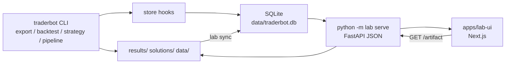

# Traderbot Lab

Lab catalogs strategy backtests in SQLite, exposes a JSON HTTP API, and ships a Next.js UI for browsing results.

## Data flow



1. CLI commands write artifacts under `results/`, `solutions/`, or `data/`.
2. On success, `lab.store` hooks upsert configuration snapshots and evaluation runs (disable with `TRADERBOT_STORE=0`).
3. `python -m lab sync --root results` backfills from existing `results.json` and `backtest_summary.json` files.
4. `python -m lab serve` reads the database and serves REST JSON plus safe file paths via `/artifact`.
5. `apps/lab-ui` calls the API from the browser (CORS enabled for `http://localhost:3000`).

Lab jobs (export, strategy compare, pipelines) run **in-process** in the API — no `cli` subprocess.

## Environment

| Variable | Purpose |
|----------|---------|
| `TRADERBOT_STORE` | Set to `0` to disable automatic recording |
| `NEXT_PUBLIC_API_BASE` | Browser API base (default `/lab-api` — proxied to FastAPI by Next.js) |
| `LAB_API_PROXY_TARGET` | Where Next rewrites `/lab-api/*` (default `http://127.0.0.1:8765`) |
| `LAB_ALLOWED_DEV_ORIGINS` | Extra hostnames for Next `allowedDevOrigins` (comma-separated). Lab UI also allowlists local interfaces plus broad `*.*…` wildcards for LAN dev. |

Default database: `data/traderbot.db` (created by `python -m lab init`).

## Local development

One terminal (API + UI):

```bash
pip install -e ".[ui,dev]"
python -m lab sync --root results   # optional backfill
./run-lab.sh
```

`./run-lab.sh` starts the UI and ensures the Lab API on port 8765 is current: if something old is already listening, it is stopped and replaced (health must include `live_job_logs`). Start a **new** background job after restart to see streaming logs.

Two terminals:

```bash
./run-lab-api.sh
```

```bash
./run-lab-ui.sh
```

`python -m lab serve` auto-creates the SQLite schema on startup (`data/traderbot.db`).

Dev helpers: `run-lab-ui.sh` frees `LAB_UI_PORT` (default 3000) before `next dev`. Set `LAB_KILL_UI_PORT=0` to skip. API bind address defaults to `0.0.0.0` via `run-lab-api.sh` (`LAB_API_HOST`). Lab API CORS allows any origin (local research only).

Open [http://localhost:3000](http://localhost:3000). API docs: [http://127.0.0.1:8765/docs](http://127.0.0.1:8765/docs).

## Layout

- `lab/store/` — schema, upserts, queries (no HTTP).
- `lab/` — FastAPI app, CORS, artifacts, allowlisted jobs.
- `cli/` — operator CLI (`python -m cli` / `traderbot`).
- `traderbot/` — strategies, pipelines, backtests, markets, live terminal.
- `apps/lab-ui/` — Next.js App Router UI only.

## UI routes

| Route | Purpose |
|-------|---------|
| `/` | Overview (research loop, stats, recent runs) |
| `/data` | Export OHLC job + download CSVs from `data/` |
| `/runs`, `/runs/[id]` | Browse runs, metrics, PNG charts, `results.json` download |
| `/configs` | Configuration snapshots |
| `/experiments` | Lab — strategy test and compare, optimizer sweeps, pipelines, compare charts. Sections: Run, Pipelines (`#pipelines`), Compare results (`#compares`), Sweeps (`#sweeps`) |
| `/actions` | Redirects to `/experiments` |
| `/custom` | Custom end-to-end pipeline (export, multi-dataset, compare) |
| `/live` | Terminal paper/live: once, UDF poll loop, CSV replay (job log + stop) |
| `/settings` | Nobitex login, API keys, profile |

## API (UI-facing)

| Method | Path | Notes |
|--------|------|--------|
| GET | `/api/stats`, `/api/runs`, `/api/runs/{id}`, `/api/configurations`, `/api/experiments`, `/api/compare-sessions`, `/api/sweeps`, `/api/sweeps/best`, `/api/pipelines` | Catalog |
| POST | `/api/experiments/sync` | Register `config/experiment*.json` in SQLite (no pipeline run) |
| GET | `/api/datasets` | Catalog OHLC datasets. `label` includes horizon (when the file is under `horizons/<label>/`) and the CSV start and end dates. |
| GET | `/api/datasets/{id}/download` | Download a catalog dataset file |
| GET | `/api/data/markets?scope=&q=&limit=&offset=` | Search cloned market rows in SQLite |
| POST | `/api/data/markets/sync?scope=` | Re-clone markets from Nobitex or jobs file into SQLite |
| GET | `/api/artifacts/list?out_dir=` | PNG paths under a run/solution directory |
| GET | `/artifact?path=` | Download file (`results/`, `solutions/`, `data/`) |
| GET | `/api/jobs`, `/api/jobs/{id}` | Background job status |
| POST | `/api/jobs/{id}/stop` | Stop a queued or running in-process job |
| GET | `/api/auth/status`, `/api/auth/profile`, `/api/auth/api-keys` | Nobitex credentials (`.env` on API host) |
| POST | `/api/auth/login`, `/api/auth/api-keys` | Session login / create API key (writes `.env` when requested) |
| GET | `/api/catalog/strategies`, `/api/catalog/strategy-params?strategy_id=`, `/api/catalog/optimized-strategy-params?strategy_id=&symbol=&resolution=&dataset_id=`, `/api/catalog/terminal` | Strategy and terminal catalogs |
| POST | `/api/jobs/export`, `/api/jobs/strategy-test`, `/api/jobs/strategy-compare`, `/api/jobs/strategy-sweep`, `/api/jobs/pipeline-run`, `/api/jobs/pipeline-run-config`, `/api/jobs/custom-research`, `/api/jobs/terminal-once`, `/api/jobs/terminal-replay`, `/api/jobs/terminal-live` | In-process background jobs |

`GET /api/pipelines` includes `full`, `steps`, and `inputs` for the Lab Pipelines tab. Full pipelines are the end-to-end jobs. The Pipelines tab keeps Active (run forms) separate from a library where you turn pipelines on or rename the label in this browser. `POST /api/jobs/pipeline-run` takes `pipeline_id` plus those inputs (`dataset_id`, `days`, `all_assets`, `horizon`, `fast`, `slow`). Saved configs use `pipeline-run-config`, which accepts the same `params` and per-step `step_params` the form shows.

`strategy-test` and `strategy-compare` take `mode`: `strategies` (rule strategies only). `strategy-test` also requires `strategy_id`. Both jobs accept optional `cash`, `fee`, `slippage` (fractions, e.g. `0.001`), `execution` (`close` or `next_open`), `vectorbt`, and strategy knobs (`fast`, `slow`, `signal`, `period`, `oversold`, `overbought`, `num_std`, `context_bars`, `price_confirm`). Returns are net of fee + slippage; `next_open` fills at the next bar open (last-bar signals expire).

`strategy-sweep` (optimizer) takes `dataset_id` (or `csv`), `strategy_id`, `mode`, and a 1–2 param grid as `params` (`{name: [values]}`) or `param_specs` (`["name=v1,v2"]`). Grid names must be strategy-namespace fields; `GET /api/catalog/strategy-params?strategy_id=` lists the knobs each strategy actually consumes (with kinds and defaults). Optional `cash`, `fee`, `slippage`, `execution`, `holdout_tail_bars` (rank by the last N bars; omit for full-run return), `min_trades`, `max_combos`, plus any other strategy-namespace knob as the base value underneath the grid. It writes `sweep_manifest.json` (default `results/strategies/sweep/<csv>_<strategy>/`) and records the winner in SQLite (`/api/sweeps`, `/api/sweeps/best`).

`POST /api/jobs/custom-research` runs optional `export_market_symbol` + `interval` + `export_days` (or a batch `export_market_symbols` × `export_intervals` matrix, max 24 combos; per-horizon history via `export_days_by_interval` like `{"15": 7}`, falling back to `export_days`; or step-based via `export_steps` / `export_steps_by_interval`, which sizes days as `ceil(steps × minutes / 1440) + 1` and trims files to the last N bars), then on each selected catalog `dataset_ids` entry and/or `use_all_hourly_files` (`*_60.csv`): optional `compare_strategies` (`max_strategies`, `strategy_ids`, `cash`, `fee`, `slippage`, `execution`, `visualize`). Files with no bars (empty file or outside the run window) are skipped, not fatal, unless every file is skipped. At least one data source and `compare_strategies` is required.

Agent conventions for the UI: `.cursor/rules/lab-ui.mdc`.
